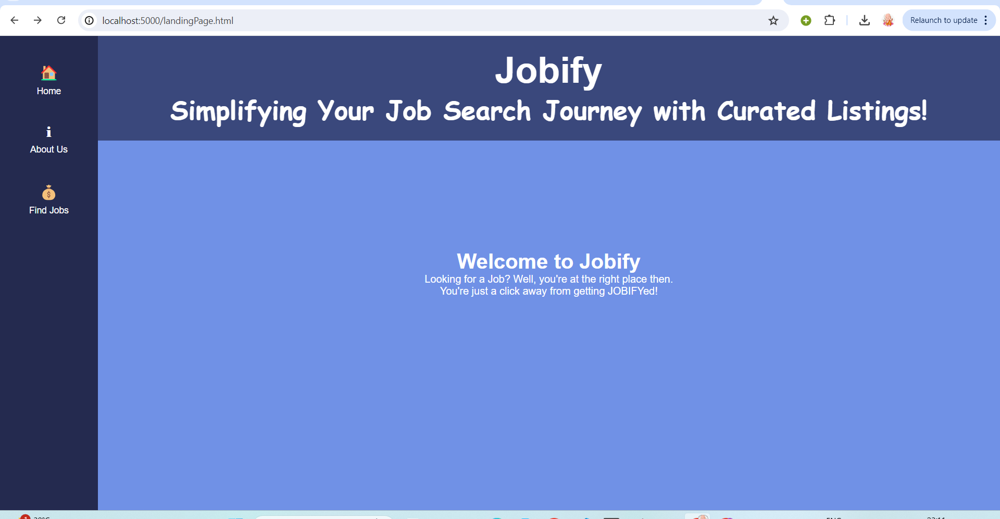
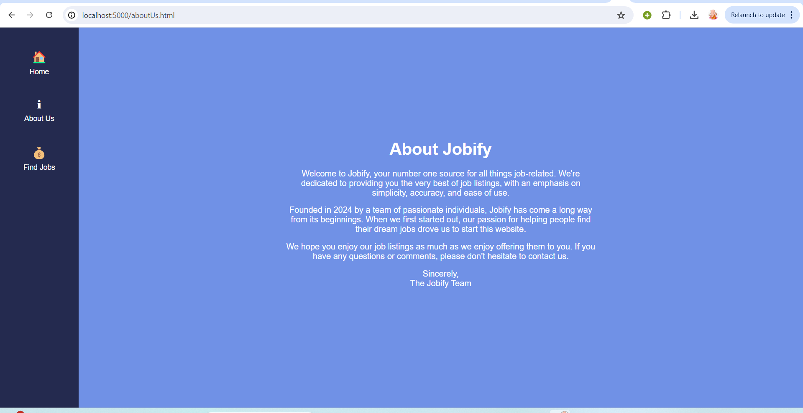
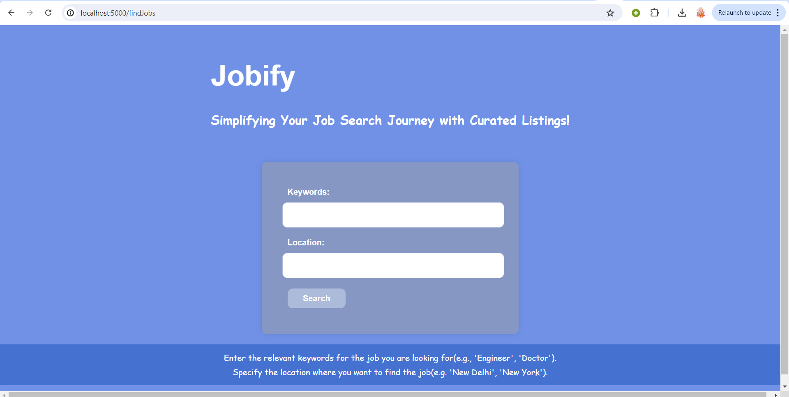
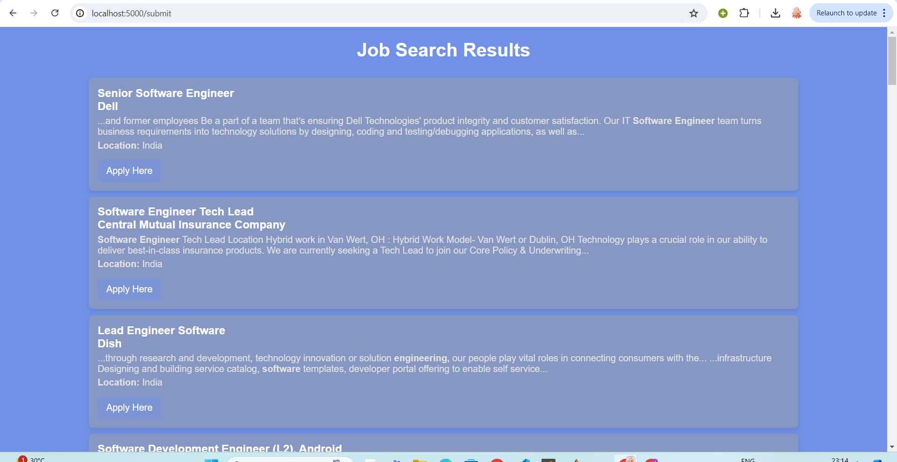

Welcome to the our project.

# Jobify : Simplifying Your Job Search Journey with Curated Listings!

## Description

Jobify is a job search platform designed to help users find suitable jobs effortlessly. With a user-friendly interface and powerful search capabilities, Jobify connects job seekers with employers quickly and efficiently.

## Contributors

- **Contributor 1**: Harsh Dahiya
- **Contributor 2**: Jitender Jangra

## Tech Stack

- **Front-end**: HTML, CSS, JavaScript, Embedded JavaScript
- **Back-end**: Node.js, Express.js
- **Database**: -
- **Other Technologies**: Axios for HTTP requests, EJS for templating

## Screenshots

### Landing Page

### About Us Page

### Job Search Page

### Job Listing Page

